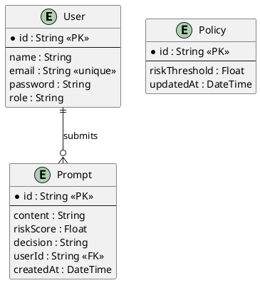

# ER Diagram

## Prompt Risk Evaluation & Policy Management System

Since we're using MongoDB, these aren't traditional relational tables — they're document collections. But the structure is similar enough that we can model them as entities with clear fields and relationships.

### Entities

#### User
| Field    | Type   | Description                           |
|----------|--------|---------------------------------------|
| id       | String | Auto-generated unique ID              |
| name     | String | User's full name                      |
| email    | String | Must be unique across all users       |
| password | String | Stored as a hashed value              |
| role     | String | Either "USER" or "ADMIN"              |

#### Prompt
| Field     | Type   | Description                              |
|-----------|--------|------------------------------------------|
| id        | String | Auto-generated unique ID                 |
| content   | String | The actual prompt text submitted         |
| riskScore | Float  | Score calculated by the risk engine      |
| decision  | String | Either "ALLOW" or "BLOCK"                |
| userId    | String | References the User who submitted it     |
| createdAt | Date   | Automatically set when the record is created |

#### Policy
| Field         | Type   | Description                           |
|---------------|--------|---------------------------------------|
| id            | String | Auto-generated unique ID              |
| riskThreshold | Float  | The current threshold for decisions   |
| updatedAt     | Date   | Updated automatically on each change  |

### Relations
- A **User** can submit many **Prompts** (one-to-many).
- **Policy** is a standalone collection — there's typically just one active record.

### PlantUML

