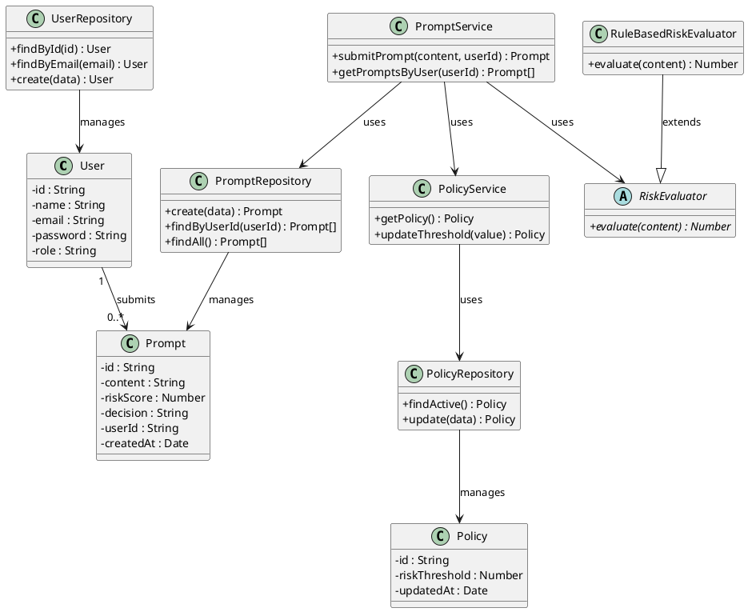

# Class Diagram

## Prompt Risk Evaluation & Policy Management System

This diagram shows the main classes in the backend, grouped by their role. The models represent the data, the services handle business logic, the risk engine does the scoring, and the repositories take care of database access.

### Classes Overview

| Class                    | Type       | Description                                     |
|--------------------------|------------|-------------------------------------------------|
| User                     | Model      | Registered user with a role (USER or ADMIN)     |
| Prompt                   | Model      | A submitted prompt along with its score and decision |
| Policy                   | Model      | Stores the current risk threshold               |
| PromptService            | Service    | Coordinates prompt evaluation and storage       |
| PolicyService            | Service    | Handles reading and updating the policy         |
| RiskEvaluator            | Abstract   | Base class for risk scoring strategies          |
| RuleBasedRiskEvaluator   | Strategy   | Scores prompts using keyword and pattern rules  |
| UserRepository           | Repository | Reads and writes User records                   |
| PromptRepository         | Repository | Reads and writes Prompt records                 |
| PolicyRepository         | Repository | Reads and writes Policy records                 |

### PlantUML

