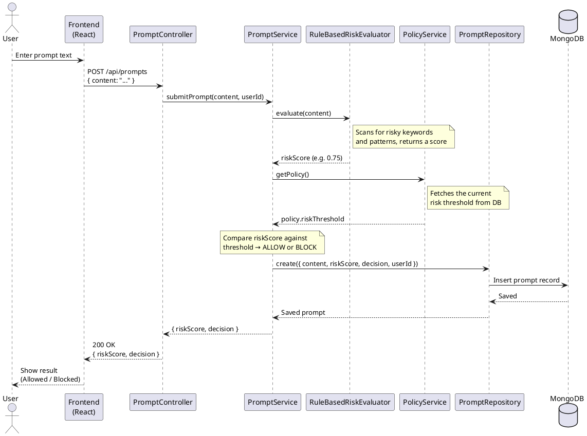

# Sequence Diagram

## Prompt Submission Flow

This diagram walks through what happens when a user submits a prompt. The request goes from the frontend to the backend, gets scored by the risk engine, checked against the policy threshold, saved to the database, and then the result is sent back.

### PlantUML

