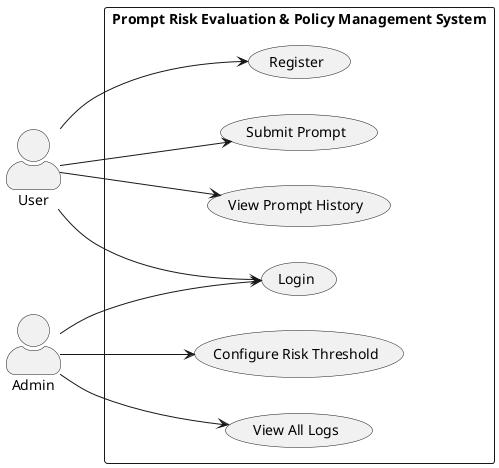

# Use Case Diagram

## Prompt Risk Evaluation & Policy Management System

There are two main actors in the system — a regular **User** and an **Admin**. Users interact with the prompt submission side of things, while Admins handle the configuration and monitoring.

### Actors

- **User** — Can register, log in, submit prompts, and check their past submissions.
- **Admin** — Can log in, set the risk threshold, and view all audit logs.

### Use Cases

| Actor | Use Case                 |
|-------|--------------------------|
| User  | Register                 |
| User  | Login                    |
| User  | Submit Prompt            |
| User  | View Prompt History      |
| Admin | Login                    |
| Admin | Configure Risk Threshold |
| Admin | View All Logs            |

### PlantUML

